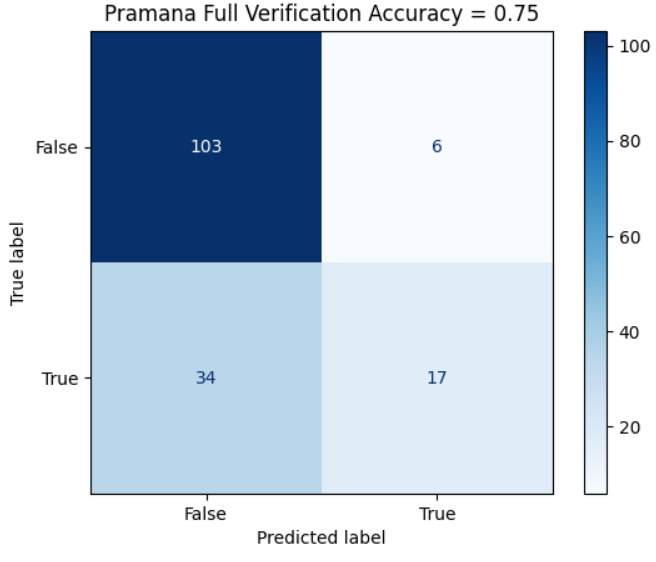

# 🧩 Pramāṇa Protocol (Pre‑Verification Layer)

Pramāṇa is a **pre‑verification protocol** designed to verify content *before* it goes live, rather than after the fact. It provides a robust backend-integrated layer for content management systems (CMS), social platforms, and marketplaces to ensure that all user-generated content is checked and signed before publication.

**Three‑Node Architecture:**
- **Gateway node:** Receives content submissions from the platform, orchestrates verification, and returns signed proofs.
- **Text verifier node:** Analyzes and verifies text-based content using AI and external fact sources.
- **Media verifier node:** Handles images, video frames, and other media for authenticity, manipulation, and context checks.

**Key Protocol Features:**
- **Content hashing:** Every submission is hashed for integrity and deduplication.
- **Caching:** Verified responses are cached for instant retrieval and reduced cost.
- **Signed proofs:** Each verification result is cryptographically signed by the protocol nodes.
- **Trust tags:** Attestations and trust-level tags are attached to content for downstream consumers and moderators.

Platforms integrate this protocol layer directly into their backend workflows to gate content before it is visible to end users, maximizing trust and minimizing the spread of misinformation.

## ☁️ Cloud & LLM Execution (Azure + GCP)

- **Azure VM deployment:** The three-node protocol runs via Docker Compose on a single Azure VM for easy scaling and management.
- **Azure OpenAI (GPT‑4o‑mini):** When enabled, the text verifier node uses GPT‑4o‑mini for advanced LLM-based verification.
- **Proof of execution:** All actions are logged and responses (including LLM outputs) are cached for traceability.
- **GCP support:** Google Cloud Platform components (BigQuery caching, Cloud Run, Vision API) remain fully supported and are described below.

---
# Pramana - AI-Powered Fact Verification


An Android App that provides one-tap fact verification from any mobile app via the system Share sheet, with transparent AI explanations and verified citations.


## 📱 Download Pramana

Click below to download and install the latest APK:

[⬇️ Download Pramana APK](https://github.com/channi23/OrangeLens/releases/download/v4.0/Pramana-Version-4.apk)

note: while downloading don't scan the app , it may stop the installation

## 🎯 USP
One-tap fact verification from any mobile app via the system Share sheet enabling fast, reliable checks with minimal effort. Backed by Retrieval-Augmented Generation (RAG) for contextual accuracy and transparent AI explanations with verified citations. Built on Google Cloud for scalability, cost-efficiency, and trust. Designed for ease of use with fewer steps and seamless integration on Android.


## 📈 Benchmark Snapshot (Nov 2025)

We run an internal regression suite against the curated dataset in `tests/misinformation_final.csv` (texts, images, links).  
The latest run produced:

- **Overall accuracy:** **75.00 %**
- **Plot:**  
  

You can explore the test-reports in the `/tests` directory.

> **Honest status:** These are early numbers. We’re actively refining prompts, evidence retrieval, and media handling (especially video) to push accuracy well above 75 %. Expect rapid iterations and model fine-tuning over the next releases.


## 🏗️ Architecture

```
TruthLens/
├── api/                    # Backend API (Cloud Run)
│   ├── main.py            # FastAPI application with integrated Vision API and Serper search
│   ├── requirements.txt   # Python dependencies
│   └── Dockerfile        # Container configuration with async Vision calls support
├── infra/                  # Infrastructure configs
│   ├── terraform/         # Terraform configurations
│   ├── cloudbuild.yaml   # Cloud Build config
│   └── api-gateway.yaml  # API Gateway spec
├── vision/                 # Vision API integration for entity and face recognition
├── cache/                  # BigQuery caching layer for verification responses
├── scripts/               # Deployment scripts
└── docs/                  # Documentation
```

## 🚀 Quick Start

### Prerequisites
- Python 3.11+
- Google Cloud SDK
- GCP Project with billing enabled

### Development Setup
```bash
# Clone the repository
git clone https://github.com/channi23/OrangeLens.git
cd OrangeLens

# Setup your specific project (orange-lens-472108)
./scripts/setup-orange-lens.sh

# Start backend development server
./scripts/start-dev.sh
```

### Production Deployment
```bash
# Deploy to Google Cloud
./scripts/deploy.sh
```

## 📱 Features
- ✅ **One-tap verification** from any Android app via Share sheet
- ✅ **Text and image verification** using AI
- ✅ **Fast/Deep verification modes**
- ✅ **Multi-language support** (English, Hindi, Tamil)
- ✅ **Real-time metrics** (latency, cost)
- ✅ **Transparent AI explanations**
- ✅ **Verified citations** from fact-check databases
- ✅ **Vision-based celebrity and object detection**
- ✅ **Smart video frame sampling** for improved authenticity verification
- ✅ **Cached verification responses** for faster results
- ✅ **Clickable citations and collapsible sections** in the app

## 🔧 Tech Stack
- **Android Client**: Native Android app using system Share sheet
- **Backend**: Cloud Run with caching, API Gateway, Vertex AI Gemini, Google Cloud Vision API
- **Data**: BigQuery caching, Cloud Storage, Google Fact Check API
- **Security**: Secret Manager, API Keys/JWT
- **Monitoring**: Cloud Logging, Cloud Monitoring with latency and cache hit ratio tracking
- **Infrastructure**: Terraform, Cloud Build

## 📊 Cost Estimate
~$200/month for 50k queries (covered by GCP credits)

## 🏃‍♂️ Getting Started

### 1. Setup Development Environment
```bash
./scripts/setup-dev.sh
```

### 2. Run Locally (Backend API)
Follow these steps to run the API locally for development.

#### Backend API (FastAPI)
1) Configure environment
```bash
cd api
cp config.env.example .env
# Edit .env and set at least:
# GOOGLE_CLOUD_PROJECT=local-dev
# GOOGLE_CLOUD_LOCATION=us-central1
# GEMINI_MODE=vertex
# GEMINI_MODEL=gemini-2.5-flash-lite
# SERPER_API_KEY=YOUR_SERPER_API_KEY   # optional news search fallback
# GEMINI_API_KEY=YOUR_GEMINI_API_KEY  # only needed when using Express REST locally
# FACT_CHECK_API_KEY=YOUR_FACT_CHECK_API_KEY  # optional (enables deep fact checks)
```
2) Install and run
```bash
python3 -m venv .venv
source .venv/bin/activate
pip install --upgrade pip
pip install -r requirements.txt
uvicorn main:app --reload --host 0.0.0.0 --port 8080
```
3) Quick tests
```bash
# Fast (text, image, hybrid verification)
curl -X POST http://localhost:8080/v1/verify \
  -H 'Content-Type: application/json' \
  -d '{"text":"The Earth orbits the Sun.","language":"en"}'

# Image (multipart, unauthenticated for dev)
curl -X POST http://localhost:8080/v1/verify-image-test \
  -F 'text=What is shown?' -F 'language=en' -F 'image=@/path/to/photo.jpg'
```

Notes
- `/v1/verify` now supports text, image, and hybrid verification with integrated Serper search and Vision-based entity detection.
- Gemini requests default to Vertex Gemini 2.5 Flash Lite (service account auth). Set `GEMINI_MODE=vertex` unless you specifically need the Express REST API.
- Evidence retrieval first queries Google Fact Check Tools; if nothing is found, it falls back to a news search (Serper.dev) when `SERPER_API_KEY` is configured.
- Deep checks (or low confidence) can call Google Fact Check API when `FACT_CHECK_API_KEY` is provided.

### 3. Test the API (optional)
```bash
./scripts/test-api.sh
```
> This helper script requires `jq` for pretty-printing JSON. Install it via `brew install jq` (macOS) or your distribution's package manager.

## 🚀 Deployment

### Prerequisites
1. GCP Project with billing enabled
2. gcloud CLI installed and authenticated
3. Required APIs enabled

### Deploy to Production
```bash
# Set your project ID (already configured)
export PROJECT_ID="orange-lens-472108"

# Deploy everything
./scripts/deploy.sh
```

### Manual Deployment Steps
1. **Enable APIs**: Run the deployment script
2. **Create Infrastructure**: Deploy Terraform configurations
3. **Build & Deploy API**: Cloud Build + Cloud Run with automatic scaling and async Vision API calls support
4. **Configure Monitoring**: Set up alerts and dashboards

## 📚 Documentation
- [API Documentation](api/README.md)
- [Infrastructure Documentation](infra/README.md)

## 🧪 Testing

### API Testing
```bash
# Test health endpoint
curl http://localhost:8080/healthz

# Test verification endpoint
curl -H "Authorization: Bearer test-key" \
     -F "text=The Earth is round" \
     -F "mode=fast" \
     -F "language=en" \
     http://localhost:8080/v1/verify
```

## 🔒 Security
- **API Keys**: Bearer token authentication
- **Service Accounts**: IAM-based permissions
- **Data Encryption**: All data encrypted at rest and in transit
- **PII Protection**: User data anonymized
- **Retention Policies**: Automatic data deletion

## 📊 Monitoring
- **Cloud Logging**: Application logs
- **Cloud Monitoring**: Metrics and alerting
- **BigQuery**: Analytics and reporting
- **Uptime Checks**: Service availability
- **Additional**: Supports latency tracking and cache hit ratio logging for performance insights

## 🛠️ Development

### Project Structure
```
TruthLens/
├── api/                     # Python FastAPI backend
│   ├── main.py             # Main API application with Vision API integration
│   ├── simple_main.py      # Simple development server
│   ├── requirements.txt    # Dependencies
│   └── Dockerfile          # Container config with async Vision support
├── vision/                  # Vision API integration modules
├── cache/                   # BigQuery caching layer
│   ├── cache_manager.py    # Cache handling logic
├── infra/                   # Infrastructure
│   ├── terraform/          # Terraform configs
│   ├── cloudbuild.yaml     # CI/CD config
│   └── api-gateway.yaml    # API Gateway spec
└── scripts/                # Deployment scripts
    ├── deploy.sh           # Production deployment
    ├── setup-dev.sh        # Development setup
    └── start-dev.sh        # Start dev servers
```

### Adding Features
1. **API**: Add endpoints in `api/main.py`
2. **Vision**: Add entity and face recognition features in `vision/`
3. **Cache**: Implement caching logic in `cache/`
4. **Infrastructure**: Update Terraform configs
5. **Monitoring**: Add metrics and alerts including latency and cache hit ratio

## 🤝 Contributing
1. Fork the repository
2. Create a feature branch
3. Make your changes
4. Add tests
5. Submit a pull request

## 🆘 Suggestions? Email us here : orangxai@gmail.com


## 🗺️ Roadmap
- [ ] Mobile app (iOS/Android)
- [ ] Browser extension
- [ ] Telegram bot
- [ ] WhatsApp integration
- [ ] Advanced analytics
- [ ] Custom fact-check sources
- [ ] API rate limiting
- [ ] Multi-tenant support


<span style="font-weight:bold;">--------------------------------------------------------------------------------------------------------------------------------------------------</span>

<span style="font-size:2em; font-weight:bold;">🪟 Windows Setup Guide (Single Terminal)</span>

This section explains how to set up and run the OrangeLens/TruthLens API locally on Windows using a single PowerShell terminal. It complements the Linux/macOS steps above and does not replace them.

### 🖥️ Prerequisites

- Python 3.12 (Download from https://www.python.org/downloads/ and check "Add Python to PATH")
 the version has to be 3.12 as anything above will need you to separately install rust and cargo 
- Google Cloud Project with required APIs enabled:
  - Vertex AI API
  - Cloud Storage API
  - Secret Manager API
  - BigQuery API
- A Service Account with roles:
  - BigQuery Data Editor
  - BigQuery Job User
  - Secret Manager Secret Accessor
  - Storage Object Admin
  - Vertex AI User
- <span style="font-size:2em; font-weight:bold;">A JSON key for that service account (downloaded from Google Cloud Console)  this is essential and is needed to be kept as a secret dont include it with the project files</span>

### 📦 Setup Instructions (Single Terminal)

#### 1) Clone the repository

```powershell
git clone https://github.com/channi23/OrangeLens.git
cd OrangeLens\api
```

#### 2) Create and activate virtual environment

```powershell
# Create a virtual environment with Python 3.12
python -m venv .venv

# If scripts are blocked in PowerShell, bypass for this session
Set-ExecutionPolicy -Scope Process -ExecutionPolicy Bypass -Force

# Activate venv
.\.venv\Scripts\Activate.ps1
```
#### 3) Install dependencies

```powershell
python -m pip install --upgrade pip
pip install -r requirements.txt
```

#### 4) Configure Google Application Credentials

1. In Google Cloud Console → IAM & Admin → Service Accounts, select your API service account.
2. Open Keys tab → Add Key → Create new key → choose JSON.
3. Download the key and move it to a safe folder (not tracked by git):

```powershell
New-Item -ItemType Directory -Force "C:\Users\<YourName>\OrangeLensKeys"
Move-Item "$env:USERPROFILE\Downloads\truth-lens-service-key.json" `
          "C:\Users\<YourName>\OrangeLensKeys\truth-lens-service-key.json"
```

Add the folder to .gitignore to avoid committing keys:

```
# in .gitignore
/OrangeLensKeys/*.json
```

Set the environment variable in the same terminal:

```powershell
$env:GOOGLE_APPLICATION_CREDENTIALS="C:\Users\<YourName>\OrangeLensKeys\truth-lens-service-key.json"
```

#### 5) Test Google Cloud connection (optional)

Run this quick test in the same terminal:

```powershell
python - <<'PY'
from google.cloud import storage
client = storage.Client()
print("✅ Connected to project:", client.project)
PY
```

You should see your project ID (for example, orange-lens-472108).

#### 6) Run the API (same terminal)

```powershell
uvicorn main:app --reload --host 127.0.0.1 --port 8080
```

When it starts, visit:

- API Root: http://127.0.0.1:8080
- Interactive Docs: http://127.0.0.1:8080/docs

If you are also running the Android app, set the API URL accordingly.

### 🛠️ Troubleshooting
- path to .JSON keys in gcloud (Googlecloud->console->secret manager-> create secret->now make the key or if key exists click on the three dots and copy the json into a file )
- DefaultCredentialsError: Your default credentials were not found
  - Double-check that `$env:GOOGLE_APPLICATION_CREDENTIALS` is set correctly in the current terminal.
  - The path must point to your `.json` key file.
  - If you open a new terminal, re-run `Activate.ps1` and set `$env:GOOGLE_APPLICATION_CREDENTIALS=...` again.

- gcloud: command not found
  - You do not need the gcloud CLI if you already have a JSON key file. Just set the environment variable as shown above.

### 🔒 Security Notes

- Never commit the `.json` key file to Git, or share it to other unauthorized people as they can manipulate the project files.
- Rotate keys regularly and delete unused keys from GCP.
- For production, consider Secret Manager or Workload Identity Federation instead of storing JSON keys locally.

### ✅ One-command shortcut (optional)

Create a `start-api.ps1` script in the project root with:

```
# start-api.ps1
.\.venv\Scripts\Activate.ps1
$env:GOOGLE_APPLICATION_CREDENTIALS="C:\Users\<YourName>\OrangeLensKeys\truth-lens-service-key.json"
uvicorn main:app --reload --host 127.0.0.1 --port 8080
```

Then run everything with:

```powershell
.\start-api.ps1
```

This provides a single-terminal workflow: activate venv → set credentials → run server on port 8080.
